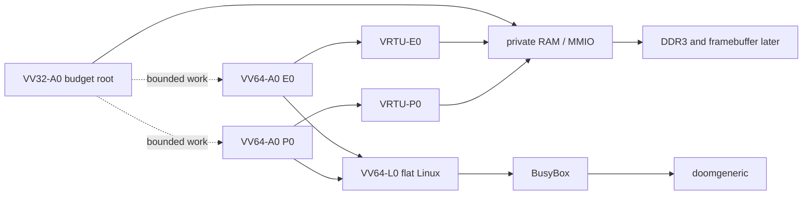

<div align="center">

# VICTORY-V

> Declare what the work may spend. Exceed it, and nothing happened.

### Verified, Isolated, Capability-safe, Timing-conscious, Outcome-explicit, Rollback-safe, Yield-bounded

A native processor family built around `VV32-A0` and `VV64-A0`.


<p>
  <a href="https://github.com/urotsuki-san/VICTORY-V/actions/workflows/ci.yml"></a>
  
  
  
  
  
  <a href="LICENSE"></a>
</p>

**[Quick start](#quick-start)** · **[Family](docs/ARCHITECTURE_FAMILY.md)** · **[Declared Footprint](docs/A0_FPGA_HANDOFF.md)** · **[VRTU](docs/VRTU.md)** · **[VV32-A0](docs/ARCHITECTURE.md)** · **[VV64-A0](docs/VV64.md)** · **[1P1E + VV32](docs/HETEROGENEOUS_CLUSTER.md)** · **[Tang 138K](docs/FPGA_138K_BRINGUP.md)** · **[Linux](docs/LINUX_PORT.md)** · **[DOOM](docs/DOOM.md)**

</div>

> [!IMPORTANT]
> `VV32-A0` has an executable model and RTL. `VV64-A0` has a synthesizable bring-up subset with both `VTRY` forms, commit preflight, 32-bit Capability Directory generations, and VRTU protection. The Tang 138K image runs direct commit, prepared commit, and rollback checks on every core before it prints `ready`; the VV64 cores also check that a Region cannot publish to the device range. Gowin placement, board validation, DDR3, a compiler target, Linux, and DOOM are still unfinished.
>
> The old Euclid nearest-neighbour block is not in the default FPGA image. Its source remains under `experiments/euclid/` as research history and an Anytime Ladder workload.

> **A processor may not declare victory until the declared work finishes and the state commits.**

VICTORY-V is its own ISA. It is not a RISC-V extension or a renamed third-party core.

`VV32-A0` is not training wheels for VV64. It remains the compact control architecture: small, deterministic, and useful for work that should stay alive when the main system is sick. `VV64-A0` is the general-purpose architecture and the Linux target.

## The family

| Profile | Job | Protection / translation | State | First target |
|---|---|---:|---|---|
| `VV32-A0` | budget root, monitor, I/O, deterministic work | capability bounds, no translation | model and RTL prototype | Tang Nano 20K / Tang 138K |
| `VV64-A0/P0` | main Linux core and longer contracts | 4-entry VRTU | FPGA bring-up profile | Tang 138K |
| `VV64-A0/E0` | smaller Linux-compatible worker | 2-entry VRTU | FPGA bring-up profile | Tang 138K |
| `VV64-L0/flat` | native `CONFIG_MMU=n` Linux | VRTU flat protection | RTL handoff | Tang 138K |
| `VV64-L0/paged` | later `V39` Linux profile | page MMU | planned | later |

P0 and E0 run the same `VV64-A0` ISA. They differ in the size of contract they can admit: P0 carries more Capability Directory, write-set, and VRTU state; E0 is meant for smaller bounded jobs.

## Rules carried by both widths

| Rule | Meaning |
|---|---|
| Capability-checked memory | Integer arithmetic cannot manufacture a declared memory range |
| Monotonic authority | Derived capabilities may narrow bounds and rights, never widen them |
| Declared footprint | Direct `VTRY` declares stores and instructions; prepared `VTRY` also admits registers, derived capabilities, arena, and release time |
| Complete rollback | Failure, budget overrun, and accepted preemption restore the entry state |
| Arena-bounded memory | Prepared work stays inside its admitted range or fails before publication |
| Root lock | Boot authority can be closed with `VLOCK` |
| Explicit failure | Region faults leave a reason instead of pretending the work succeeded |
| Quiet baseline | The first cores are in order and do not speculate effects into shared state |

## Victory Contracts

`VTRY` is the only Region-entry instruction. The operand count selects the form:

```text
VTRY fail, stores, budget   inline contract; one instruction to admit and enter
VPREP cToken, cArena, rSpec prepare a larger one-shot contract
VTRY cToken, fail           consume that contract and enter the same Region machinery
VCANCEL cToken              discard a prepared contract that will not run
```

The two encodings are called `VTRY.I` and `VTRY.C` in the specification. The assembler accepts the same `vtry` mnemonic for both; `vtry.c` is also accepted when an explicit spelling is useful. Opcode `0x3d` is `VTRYC` inside the model and RTL. There is no second entry instruction hiding behind another name.

`VPREP` only performs admission. It checks the write-set, instruction and register budgets, derived-capability budget, arena, and optional release time before architectural work starts. A copied token does not duplicate authority: consuming or cancelling one copy makes every copy stale. Prepared work cannot leave its arena, and a Region cannot reach a VRTU `DEVICE` range. Secret contracts require fixed release so early success and early abort do not become an architectural completion signal.

`VIC` checks the complete write-set before the first store is published. If an address, permission, VRTU range, or device attribute fails, the Region aborts without an external write. A bus fault after publication begins is `COMMIT_PROTOCOL`; the core stops instead of pretending that an already visible write disappeared.

## VRTU and declared ranges

A page-table walker solves a wider problem than the first no-MMU system needs. VRTU keeps the mapping small and exact.

```text
use the last proved range
    |
    v
does the whole access still fit with the required rights?
    |
    +-- yes -> translate with base + offset
    |
    +-- no  -> check the small descriptor bank
                  |
                  +-- exactly one match -> translate
                  +-- none / overlap    -> precise fault
```

VRTU is not a software-filled TLB. The descriptor bank is the mapping, so there is no refill trap and no page-table walk. P0 has four entries; E0 has two. Each path keeps one generation-checked last-range guard, borrowing guarded reuse without carrying the Euclid datapath into the processor.

The reset image uses two ranges: private RAM and boot code are identity-mapped `RWXU`, while the MMIO window is identity-mapped supervisor `RW DEVICE`. An unmapped address, a missing permission, or an overlapping mapping becomes cause 20, 21, or 22. See [`docs/VRTU.md`](docs/VRTU.md).

## Tang 138K cluster



The current image is still a bring-up system:

```text
VV32-A0                  -> private 64 KiB RAM --+
VV64-P0 -> 4-entry VRTU -> private 64 KiB RAM   +-- UART / mailboxes / timer / IPI
VV64-E0 -> 2-entry VRTU -> private 64 KiB RAM   +
```

VV32 starts first. Its mailbox releases P0; the P0 mailbox releases E0. The expected UART output is:

```text
VV32-A0 VTRY ready
VV64-P0 VTRY ready
VV64-E0 VTRY ready
```

A `ready` line is printed only after direct `VTRY` commit, prepared `VTRY` commit, and rollback have passed on that core. P0 and E0 also prove that a Region cannot publish to the MMIO/device range. This is still a bring-up image, not SMP Linux: the RAMs are private, DDR3 is disconnected, and there is no cache coherence.

## What is in the repository

- a dependency-free VV32 assembler, disassembler, and Python reference machine;
- board-independent VV32 and VV64 SystemVerilog cores;
- complete Victory Region register, capability, and VV64 Directory rollback;
- overloaded `VTRY` entry: inline `VTRY.I` and prepared `VTRY.C`;
- merged write-set buffering, commit preflight, and explicit late-fault handling;
- a 32-bit generation-checked VV64 Capability Directory;
- an exact Python VRTU model and self-checking VRTU RTL;
- P0/E0 wrappers with 4/2 VRTU entries and different hardware budgets;
- a Tang 138K three-core SoC with UART, mailboxes, timebase, timer compares, and software interrupts;
- Tang Mega and Tang Console 138K projects for device revisions B and C;
- a machine-readable Tang 138K platform manifest;
- the retired Euclid work isolated under `experiments/euclid/`.

Missing work is left visible: privilege modes, tagged context save/restore, atomics, caches, DDR3, shared memory, toolchain support, Linux, framebuffer input, and DOOM.

## Quick start

Python 3.11 or newer is required. Runtime tools use only the standard library.

```bash
git clone https://github.com/urotsuki-san/VICTORY-V.git
cd VICTORY-V
python -m pip install -e .
```

Show the architecture profiles:

```bash
vv profiles
```

Run the checks:

```bash
make test
make examples
make family-check
make fpga-check
make rtl-test       # requires Icarus Verilog
```

The archived Euclid experiment is deliberately outside the normal regression:

```bash
make experiment-euclid
```

## Victory Region example

A small Region needs no setup token:

```asm
    vtry   failed, 2, 32
    cstw   r5, c10, 0
    vic
```

A larger contract is admitted first, but still entered by `VTRY`:

```asm
    ; 2 store granules, 32 instructions, 8 written registers, 2 cap derivations
    li      r20, 0x00090402
    vprep   c12, c10, r20
    vtry    c12, failed

    add     r5, r3, r4
    cmpeq   r7, r5, r6
    cstw    r5, c10, 0
    vchk    r7, 0x1001

    vic
    halt

failed:
    verr    r12
    halt
```

## Road to Linux and DOOM

The order still matters:

```text
three-core VTRY self-test + UART + VRTU protection
  -> Gowin utilization and timing report
  -> privilege, timer, IPI, atomics, tagged context
  -> independent DDR3 test
  -> shared memory and physical caches
  -> LLVM/lld target and fast emulator
  -> CONFIG_MMU=n early console
  -> initramfs and BusyBox
  -> framebuffer and input
  -> doomgeneric
```

VRTU is the first protection path, not a promise to avoid a page MMU forever. The no-MMU port gets measured first. A paged profile is worth adding only when a real workload needs sparse address spaces, copy-on-write, or demand paging badly enough to pay for the extra state and variable walk latency.

P0 is the boot CPU and first DOOM target. E0 joins Linux after the SMP and memory rules exist. VV32 stays outside the Linux scheduler as the budget root and control core.

See [`docs/ROADMAP.md`](docs/ROADMAP.md), [`docs/LINUX_PORT.md`](docs/LINUX_PORT.md), and [`docs/DOOM.md`](docs/DOOM.md).

## Repository map

```text
VICTORY-V/
├── isa/                 ISA and family contracts
├── platform/            board-level core, VRTU, and MMIO manifests
├── src/victory_v/       assembler and executable models
├── tests/               Python checks
├── examples/            VV32 assembly programs
├── rtl/                 cores, VRTU, SoCs, ROMs, and testbenches
├── fpga/tang-138k/      Gowin projects and constraints
├── experiments/euclid/  archived early-decision research
├── formal/              initial VV32 bounded assertions
├── docs/                architecture and bring-up notes
└── tools/               consistency and ROM generators
```

## The name

The first sketch was a joke: if “RISC” sounds risky, build a processor that always wins. Its comparison instruction declared victory even when the result was wrong.

The instruction that won by lying is gone. `VTRY` stayed. It begins a bounded attempt; `VIC` is allowed to celebrate only after the checks and publication complete.

Victory means the work finished inside its declared budget. Defeat means the partial state never existed.

## License

[MIT](LICENSE)
