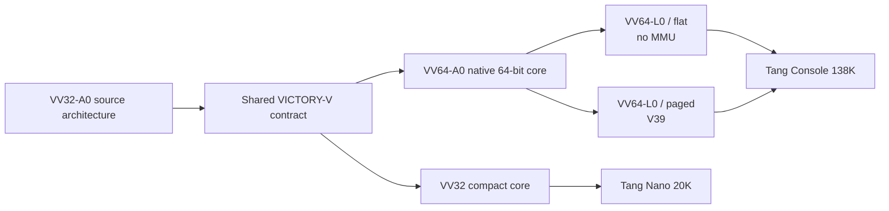

<div align="center">

# VICTORY-V

### Verified, Isolated, Capability-safe, Timing-conscious, Outcome-explicit, Rollback-safe, Yield-bounded

A native processor family built from `VV32-A0`, with `VV64-A0` as its 64-bit continuation.


<p>
  <a href="https://github.com/urotsuki-san/VICTORY-V/actions/workflows/ci.yml"></a>
  
  
  
  
  <a href="LICENSE"></a>
</p>

**[Quick start](#quick-start)** · **[Family](docs/ARCHITECTURE_FAMILY.md)** · **[VV32-A0](docs/ARCHITECTURE.md)** · **[VV64-A0](docs/VV64.md)** · **[Linux](docs/LINUX_PORT.md)** · **[日本語](docs/USAGE_JA.md)**

</div>

> [!IMPORTANT]
> The working implementation is still `VV32-A0`. `VV64-A0` is a design draft, not a finished core, compiler target, or Linux port. Do not use this repository for production security or safety-critical control.

> **A processor may not declare victory until the checks pass and the state commits.**

VICTORY-V is its own ISA. It is not a RISC-V extension, compatibility layer, or renamed third-party core.

`VV32-A0` is the source architecture: fixed 32-bit instructions, capability-checked memory, Secret Tags, bounded Victory Regions, `VLOCK`, and a simple non-speculative core. `VV64-A0` carries those rules into a 64-bit general-purpose machine. The MMU is optional; page translation is a profile feature, not the definition of the CPU.

## Architecture family

| Profile | Purpose | MMU | State | First target |
|---|---|---:|---|---|
| `VV32-A0` | Small control and deterministic work | No | Model and RTL prototype | Tang Nano 20K |
| `VV64-A0` | Native 64-bit general-purpose VICTORY-V | Optional | Architecture draft | Tang Console 138K |
| `VV64-L0/flat` | Native 64-bit no-MMU Linux | No | Planned | Tang Console 138K |
| `VV64-L0/paged` | Native 64-bit Linux with `V39` | Yes | Planned | Tang Console 138K |

The Linux profiles are configurations of `VV64-A0`, not separate instruction sets. The flat profile uses capability domains and an FDPIC or FLAT userspace. The paged profile adds conventional virtual mappings later.

## Rules inherited from VV32

| Rule | Meaning |
|---|---|
| Capability-checked memory | Integer arithmetic cannot manufacture memory authority |
| Monotonic authority | Derived capabilities may narrow bounds and rights, never widen them |
| Secret-flow tracking | Secret values cannot silently steer branches, targets, addresses, or public stores |
| Victory Regions | Writes remain private until `VIC`; failure discards them |
| Root lock | Boot authority can be closed with `VLOCK` |
| Explicit failure | Region faults record a reason instead of pretending the work succeeded |
| Optional translation | An MMU may remove access but cannot grant missing capability rights |
| Quiet baseline | The first cores are in order and do not speculate into shared state |

`VV64-A0` adds tagged context save/restore, a generation-checked Capability Directory, capability-checked atomics, sealed calls and protected returns, and `VTRYA` for abort-on-interrupt regions.

## At a glance



## What works today

The repository currently contains:

- the executable `VV32-A0` instruction contract and machine-readable ISA manifest;
- a dependency-free assembler, disassembler, and Python reference machine;
- capability bounds and permission checks;
- Secret Tags and forbidden secret-dependent control/address flow;
- bounded Victory Regions with forwarding, commit, rollback, quotas, and budgets;
- irreversible `VLOCK` root lockdown;
- a board-independent SystemVerilog core and self-checking testbench;
- a small formal harness;
- a machine-readable family contract for `VV32-A0`, `VV64-A0`, and both Linux profiles.

There is no board bitstream, C compiler backend, 64-bit executable model, or Linux port yet. Design notes are marked as design notes rather than implementation.

## Quick start

Python 3.11 or newer is required. Runtime tools use only the standard library.

```bash
git clone https://github.com/urotsuki-san/VICTORY-V.git
cd VICTORY-V
python -m pip install -e .
```

Show the family profiles:

```bash
vv profiles
```

Assemble and run the current `VV32-A0` example:

```bash
vv asm examples/victory.vs -o build/victory.vbin --listing build/victory.lst
vv run examples/victory.vs --trace --registers
```

Run the checks:

```bash
make test
make examples
make family-check
make rtl-test       # requires Icarus Verilog
```

## Victory Region example

```asm
    vtry   failed, 4, 32

    add    r5, r3, r4
    cmpeq  r7, r5, r6
    cstw   r5, c10, 0        ; held in the region store buffer
    vchk   r7, 0x1001

    vic                       ; the write becomes visible here
    halt

failed:
    verr   r12
    halt
```

A failed check, capability fault, secret-flow fault, explicit abort, exhausted store quota, or exhausted instruction budget discards pending stores and transfers control to `failed`.

## Implementation status

| Component | State |
|---|---|
| `VV32-A0` assembler and disassembler | Implemented and tested |
| `VV32-A0` reference machine | Implemented and tested |
| Capability, Secret Tag, Victory Region | Implemented in the model and RTL prototype |
| `VV32-A0` SystemVerilog core | Pre-FPGA prototype |
| Model/RTL differential testing | Not finished |
| Tang Nano 20K SoC and bitstream | Not started |
| `VV64-A0` family and architecture contract | Drafted |
| `VV64-A0` model and RTL | Not started |
| LLVM/Clang target | Not started |
| Native Linux port | Not started |

Passing the current tests means the covered model and RTL cases meet their local expectations. It is not a security certificate or a claim of silicon correctness.

## Repository map

```text
VICTORY-V/
├── isa/                 VV32 instruction manifest and family contract
├── src/victory_v/       assembler, disassembler, model, family profiles
├── tests/               executable checks
├── examples/            VV32 assembly programs
├── rtl/                 board-independent VV32 SystemVerilog core
├── formal/              initial bounded assertions
├── docs/                architecture, Linux, FPGA, and research notes
└── tools/               manifest and RTL consistency checks
```

## Hardware direction

`VV32-A0` remains the small-core track. Its first complete SoC is still intended for Tang Nano 20K.

`VV64-A0` targets Tang Console 138K. Bring-up starts with a native VICTORY-V core, on-chip RAM, and UART. DDR3 and no-MMU Linux follow only after the 64-bit model, compiler, and RTL agree. LiteX may be used for board plumbing and DDR integration; it will not supply the CPU ISA.

The two cores may later share one 138K design, with VV32 handling short protected work while VV64 runs Linux. That is a later milestone, not a shortcut around native VV64.

## The name

The first sketch was a joke: if “RISC” sounds risky, build a processor that always wins. Its comparison instruction declared victory even when the result was wrong.

That instruction is gone. The useful part survived: `VIC` now means **Victory Integrity Commit**, and it succeeds only after the checks do.

## License

[MIT](LICENSE)
