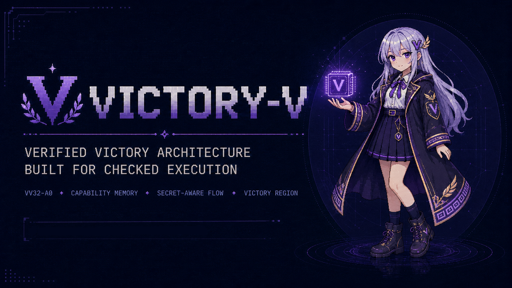
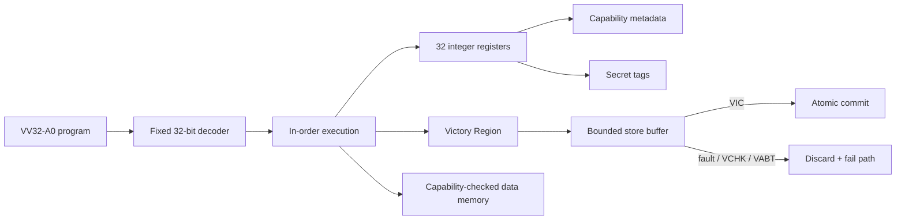

<div align="center">

# VICTORY-V

### Verified, Isolated, Capability-safe, Timing-conscious, Outcome-explicit, Rollback-safe, Yield-bounded

Experimental 32-bit ISA, executable reference model, and pre-FPGA soft-core prototype.

<p>
  <a href="https://github.com/urotsuki-san/VICTORY-V/actions/workflows/ci.yml"></a>
  
  
  
  
  <a href="LICENSE"></a>
</p>

**[Quick start](#quick-start)** · **[Architecture](docs/ARCHITECTURE.md)** · **[ISA](docs/ISA.md)** · **[Threat model](docs/THREAT_MODEL.md)** · **[FPGA handoff](docs/FPGA_HANDOFF.md)** · **[日本語](docs/USAGE_JA.md)**

</div>

> [!IMPORTANT]
> VICTORY-V is a research alpha. It has not received external architecture, security, compiler, or silicon validation. Do not use it to protect real secrets, control safety-critical equipment, or make production security claims.

> **A processor may not declare victory until the checks pass and the state commits.**

## What exists now

The `VV32-A0` pre-FPGA prototype currently includes:

- a fixed-width 32-bit instruction encoding and machine-readable ISA manifest;
- a dependency-free Python assembler, disassembler, and executable reference model;
- capability-only data-memory access with bounds and permission checks;
- per-register secret tags with branch/address-flow restrictions;
- bounded **Victory Regions** with buffered stores, rollback, and `VIC` commit;
- irreversible `VLOCK` root-capability lockdown until reset;
- a multi-cycle in-order SystemVerilog core and self-checking simulation testbench;
- a small formal harness for architectural invariants;
- cross-platform model tests and Linux RTL simulation in GitHub Actions.

The repository stops immediately before board integration: there is no Tang Nano pinout, PLL, UART SoC wrapper, Gowin project, or bitstream yet.

## The challenge

RISC-V is a broad and successful open ISA designed for many implementation styles. VICTORY-V is not presented as a drop-in replacement and currently makes no performance or security-superiority claim.

VICTORY-V instead explores a deliberately narrow question:

> What happens when capability-only memory access, secret-flow restrictions, bounded failure handling, and non-speculative execution are baseline architectural rules rather than optional system-integration choices?

That difference is intended to be measured with executable tests and FPGA results, not slogans.

## Architecture at a glance



### Core rules

| Rule | VV32-A0 behavior |
|---|---|
| Data memory | No unguarded load/store instructions; every access names a capability register |
| Capability authority | Bounds and permissions can be narrowed, not expanded; `CROOT` is disabled by `VLOCK` |
| Secret flow | Secret-tagged values cannot select a branch or memory address |
| Failure atomicity | Stores in a Victory Region remain buffered until `VIC` |
| Interrupt latency | Interrupts are deferred during a region; the encoded instruction budget bounds the delay |
| Speculation | The A0 core is in-order and does not implement speculative execution |
| Success | `VIC` means **Victory Integrity Commit**, not unconditional success |

See [`docs/ARCHITECTURE.md`](docs/ARCHITECTURE.md) for the normative A0 behavior.

## Quick start

Python 3.11 or newer is required. The tools have no runtime dependencies outside the standard library.

```bash
git clone https://github.com/urotsuki-san/VICTORY-V.git
cd VICTORY-V
python -m pip install -e . --no-build-isolation
```

Assemble and run the baseline example:

```bash
vv asm examples/victory.vs -o build/victory.vbin --listing build/victory.lst
vv run examples/victory.vs --trace --registers
```

Run the validation suite:

```bash
make test
make examples
make rtl-test       # requires Icarus Verilog
python tools/check_isa_sync.py
```

A successful reference-model run ends with output similar to:

```text
status=HALT pc=0x00000048 cause=0 victory_error=0
```

## Victory Region example

```asm
    vtry   failed, 4, 32     ; failure target, store quota, instruction budget

    add    r5, r3, r4
    cmpeq  r7, r5, r6
    cstw   r5, c10, 0        ; buffered, not externally visible
    vchk   r7, 0x1001

    vic                       ; Victory Integrity Commit
    halt

failed:
    verr   r12               ; explicit failure reason
    halt
```

A bounds failure, secret-flow violation, failed `VCHK`, explicit `VABT`, exhausted store quota, or exhausted instruction budget discards buffered stores and transfers control to `failed`.

## Implementation status

| Component | Status | Evidence |
|---|---|---|
| ISA manifest and documentation | Implemented for A0 | synchronization checker |
| Assembler and disassembler | Implemented | unit tests and examples |
| Executable reference model | Implemented | deterministic unit tests |
| Capability checks | Implemented in model and RTL prototype | bounds/permission tests |
| Secret-tag propagation | Implemented in model and RTL prototype | forbidden-branch tests |
| Victory Region | Implemented in model and RTL prototype | commit/rollback tests |
| SystemVerilog core | Pre-FPGA prototype | self-checking Icarus testbench |
| Formal verification | Initial invariant harness only | bounded SymbiYosys harness |
| C compiler / LLVM backend | Not implemented | roadmap item |
| FreeRTOS / Zephyr port | Not implemented | requires toolchain and FPGA bring-up |
| Tang Nano 20K bitstream | Not implemented | next hardware phase |

Passing tests establish implementation consistency for covered cases. They do not establish security, complete ISA conformance, timing closure, or physical correctness.

## Repository layout

```text
VICTORY-V/
├── isa/                 machine-readable VV32-A0 contract
├── src/victory_v/       assembler, disassembler, executable model
├── tests/               conformance and security-mechanism tests
├── examples/            runnable assembly demonstrations
├── rtl/                 board-independent SystemVerilog core and testbench
├── formal/              bounded invariant harness
├── docs/                architecture, ISA, ABI, threat model, roadmap
└── tools/               manifest/RTL synchronization and memory-image tools
```

## FPGA direction

The first hardware target is **Tang Nano 20K**, one board only. The board phase begins after the pre-FPGA gate in [`docs/FPGA_HANDOFF.md`](docs/FPGA_HANDOFF.md) is satisfied.

The first hardware milestone is intentionally small:

```text
VV32-A0 core + on-chip instruction RAM + on-chip data RAM + UART + timer + IRQ
```

External SDRAM, HDMI, caches, MMU, Linux, and dynamic branch prediction are out of scope for the first bitstream.

## Status

**v0.1.0-alpha.0 · pre-FPGA research prototype**

The immediate objective is model/RTL differential testing and a clean Tang Nano 20K SoC wrapper. See [`docs/ROADMAP.md`](docs/ROADMAP.md).

## License

[MIT](LICENSE)
