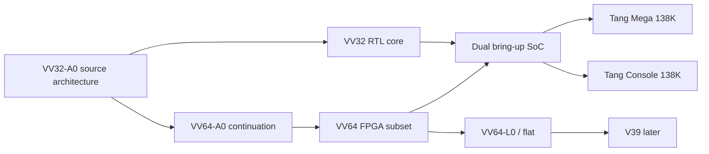

<div align="center">

# VICTORY-V

### Verified, Isolated, Capability-safe, Timing-conscious, Outcome-explicit, Rollback-safe, Yield-bounded

A native processor family built from `VV32-A0`, with `VV64-A0` as its 64-bit continuation.


<p>
  <a href="https://github.com/urotsuki-san/VICTORY-V/actions/workflows/ci.yml"></a>
  
  
  
  
  <a href="LICENSE"></a>
</p>

**[Quick start](#quick-start)** · **[Family](docs/ARCHITECTURE_FAMILY.md)** · **[VV32-A0](docs/ARCHITECTURE.md)** · **[VV64-A0](docs/VV64.md)** · **[Tang 138K](docs/FPGA_138K_BRINGUP.md)** · **[Linux](docs/LINUX_PORT.md)** · **[日本語](docs/USAGE_JA.md)**

</div>

> [!IMPORTANT]
> `VV32-A0` has an executable model and an RTL prototype. `VV64-A0` now has a synthesizable FPGA bring-up subset, not the complete architecture described in the design notes. There is still no compiler target, Linux port, released bitstream, or hardware validation.

> **A processor may not declare victory until the checks pass and the state commits.**

VICTORY-V is its own ISA. It is not a RISC-V extension, compatibility layer, or renamed third-party core.

`VV32-A0` is the source architecture: fixed 32-bit instructions, capability-checked memory, Secret Tags, bounded Victory Regions, `VLOCK`, and a simple non-speculative core. `VV64-A0` carries those rules into a 64-bit general-purpose machine. Page translation is optional and is not part of the first FPGA image.

## Architecture family

| Profile | Purpose | MMU | State | First target |
|---|---|---:|---|---|
| `VV32-A0` | Small control and deterministic work | No | Model and RTL prototype | Tang Nano 20K / Tang 138K |
| `VV64-A0` | Native 64-bit general-purpose VICTORY-V | Optional | FPGA bring-up subset | Tang Mega / Console 138K |
| `VV64-L0/flat` | Native 64-bit no-MMU Linux | No | Planned | Tang 138K |
| `VV64-L0/paged` | Native 64-bit Linux with `V39` | Yes | Planned | Later |

The Linux profiles are configurations of `VV64-A0`, not separate instruction sets. The flat profile comes first. `V39` remains a later profile.

## Rules inherited from VV32

| Rule | Meaning |
|---|---|
| Capability-checked memory | Integer arithmetic cannot manufacture memory authority |
| Monotonic authority | Derived capabilities may narrow bounds and rights, never widen them |
| Secret-flow tracking | Secret values cannot silently steer branches, targets, addresses, or public stores |
| Victory Regions | Writes remain private until `VIC`; failure discards them |
| Root lock | Boot authority can be closed with `VLOCK` |
| Explicit failure | Region faults record a reason instead of pretending the work succeeded |
| Optional translation | An MMU may remove access but cannot grant missing capability rights |
| Quiet baseline | The first cores are in order and do not speculate into shared state |

The VV64 prototype keeps the base opcode positions, widens integer state to 64 bits, adds doubleword memory access, and moves full bounds and permissions into a protected Capability Directory.

## At a glance



## What works today

The repository contains:

- the executable `VV32-A0` instruction contract and machine-readable ISA manifest;
- a dependency-free VV32 assembler, disassembler, and Python reference machine;
- capability bounds and permission checks, Secret Tags, Victory Regions, and `VLOCK`;
- board-independent VV32 and VV64 SystemVerilog cores;
- a VV64 Capability Directory with generation-checked register references;
- self-checking simulations for VV32, VV64, and a dual-core bring-up image;
- a shared UART, status mailbox, fixed boot ROM, and separate on-chip RAM for both cores;
- Gowin projects and constraints for Tang Mega 138K and Tang Console 138K, device revisions B and C;
- a small formal harness for VV32.

The VV64 FPGA subset does not yet implement privilege levels, tagged context spill/fill, atomics, sealed calls, `VTRYA`, caches, DDR3, an MMU, or Linux. Those items remain in the architecture contract and are not silently stubbed in the core.

## Quick start

Python 3.11 or newer is required. Runtime tools use only the standard library.

```bash
git clone https://github.com/urotsuki-san/VICTORY-V.git
cd VICTORY-V
python -m pip install -e .
```

Show the family profiles:

```bash
vv profiles
```

Assemble and run the current `VV32-A0` example:

```bash
vv asm examples/victory.vs -o build/victory.vbin --listing build/victory.lst
vv run examples/victory.vs --trace --registers
```

Run the checks:

```bash
make test
make examples
make family-check
make fpga-check
make rtl-test       # requires Icarus Verilog
```

`make rtl-test` runs the existing VV32 test, the VV64 core test, and the VV32/VV64 co-resident SoC test.

## Victory Region example

```asm
    vtry   failed, 4, 32

    add    r5, r3, r4
    cmpeq  r7, r5, r6
    cstw   r5, c10, 0        ; held in the region store buffer
    vchk   r7, 0x1001

    vic                       ; the write becomes visible here
    halt

failed:
    verr   r12
    halt
```

A failed check, capability fault, secret-flow fault, explicit abort, exhausted store quota, or exhausted instruction budget discards pending stores and transfers control to `failed`.

## Implementation status

| Component | State |
|---|---|
| `VV32-A0` assembler, disassembler, and model | Implemented and tested |
| `VV32-A0` SystemVerilog core | Pre-FPGA prototype |
| `VV64-A0` base integer/control RTL | Implemented for bring-up |
| VV64 capability directory and base memory checks | Implemented for bring-up |
| VV64 Victory Regions and `VLOCK` | Implemented for bring-up |
| VV32/VV64 Tang 138K image | Source and simulation present; hardware untested |
| Gowin placement, timing, and bitstream | Not run in this repository yet |
| DDR3, privilege, atomics, tagged context, sealed calls | Not implemented |
| LLVM/Clang target | Not started |
| Native Linux port | Not started |

Passing the tests means the covered model and RTL cases meet their local expectations. It is not a security certificate or a claim of silicon correctness.

## Repository map

```text
VICTORY-V/
├── isa/                 VV32 manifest and family contract
├── src/victory_v/       assembler, disassembler, model, family profiles
├── tests/               executable Python checks
├── examples/            VV32 assembly programs
├── rtl/                 VV32/VV64 cores, SoC, ROM, and testbenches
├── fpga/tang-138k/      Gowin projects, board tops, constraints, timing
├── formal/              initial VV32 bounded assertions
├── docs/                architecture, Linux, FPGA, and research notes
└── tools/               manifest, ROM, and consistency checks
```

## Hardware direction

The first 138K image is deliberately small: two native VICTORY-V cores, separate on-chip RAM, one UART, status mailboxes, and LEDs. VV32 reports first, then VV64 is released. The UART should print:

```text
VV32-A0 ready
VV64-A0 ready
```

This is a bring-up image, not a scheduler or a Linux system. DDR3 stays out until clock, reset, UART, both cores, and the memory checks have been seen on the actual board. See [`docs/FPGA_138K_BRINGUP.md`](docs/FPGA_138K_BRINGUP.md).

## The name

The first sketch was a joke: if “RISC” sounds risky, build a processor that always wins. Its comparison instruction declared victory even when the result was wrong.

That instruction is gone. The useful part survived: `VIC` now means **Victory Integrity Commit**, and it succeeds only after the checks do.

## License

[MIT](LICENSE)
