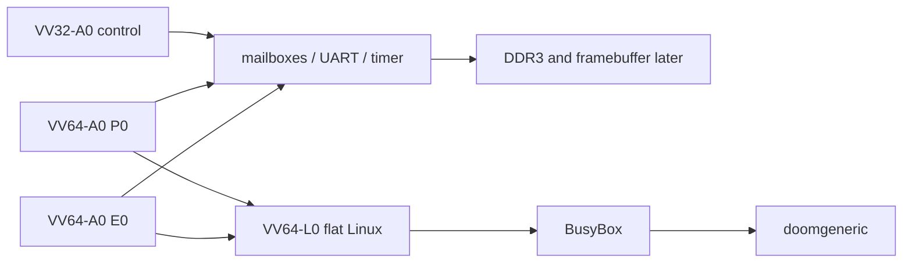

<div align="center">

# VICTORY-V

### Verified, Isolated, Capability-safe, Timing-conscious, Outcome-explicit, Rollback-safe, Yield-bounded

A native processor family built around `VV32-A0` and `VV64-A0`.


<p>
  <a href="https://github.com/urotsuki-san/VICTORY-V/actions/workflows/ci.yml"></a>
  
  
  
  
  
  <a href="LICENSE"></a>
</p>

**[Quick start](#quick-start)** · **[Family](docs/ARCHITECTURE_FAMILY.md)** · **[VV32-A0](docs/ARCHITECTURE.md)** · **[VV64-A0](docs/VV64.md)** · **[1P1E + VV32](docs/HETEROGENEOUS_CLUSTER.md)** · **[Tang 138K](docs/FPGA_138K_BRINGUP.md)** · **[Linux](docs/LINUX_PORT.md)** · **[DOOM](docs/DOOM.md)**

</div>

> [!IMPORTANT]
> `VV32-A0` has an executable model and an RTL prototype. `VV64-A0` has a synthesizable bring-up subset. The Tang 138K source now instantiates one VV32 control core, one VV64-P0 core, and one VV64-E0 core. Gowin placement, hardware validation, DDR3, a compiler target, Linux, and DOOM are still unfinished.

> **A processor may not declare victory until the checks pass and the state commits.**

VICTORY-V is its own ISA. It is not a RISC-V extension or a renamed third-party core.

`VV32-A0` is not training wheels for VV64. It remains the compact control architecture: small, deterministic, and useful for work that should stay alive even when the main system is sick. `VV64-A0` is the general-purpose architecture and the Linux target.

## The family

| Profile | Job | MMU | State | First target |
|---|---|---:|---|---|
| `VV32-A0` | monitor, I/O, watchdog, deterministic work | No | model and RTL prototype | Tang Nano 20K / Tang 138K |
| `VV64-A0/P0` | main Linux core and latency-sensitive work | No in the first system | FPGA bring-up profile | Tang 138K |
| `VV64-A0/E0` | smaller Linux-compatible worker | No in the first system | FPGA bring-up profile | Tang 138K |
| `VV64-L0/flat` | native no-MMU Linux | No | planned | Tang 138K |
| `VV64-L0/paged` | later `V39` Linux profile | Yes | planned | later |

P0 and E0 run the same `VV64-A0` ISA. They are implementation profiles, not new instruction sets. P0 currently has a deeper Victory Region store buffer and a larger Capability Directory. E0 uses a smaller envelope. The execution engine is still shared; caches, multiplication, and clocking have not diverged yet.

## Rules carried by both widths

| Rule | Meaning |
|---|---|
| Capability-checked memory | Integer arithmetic cannot manufacture memory authority |
| Monotonic authority | Derived capabilities may narrow bounds and rights, never widen them |
| Secret-flow tracking | Secret values cannot silently steer branches, targets, addresses, or public stores |
| Victory Regions | Writes stay private until `VIC`; failure discards them |
| Root lock | Boot authority can be closed with `VLOCK` |
| Explicit failure | Region faults leave a reason instead of pretending the work succeeded |
| Quiet baseline | The first cores are in order and do not speculate effects into shared state |

## Tang 138K cluster



The current image is deliberately plain:

```text
VV32-A0  -> private 64 KiB RAM --+
VV64-P0  -> private 64 KiB RAM --+-- UART / mailboxes / timer / IPI
VV64-E0  -> private 64 KiB RAM --+
```

VV32 starts first. P0 starts after the VV32 mailbox arrives. E0 starts after the P0 mailbox arrives. The UART should print:

```text
VV32-A0 ready
VV64-P0 ready
VV64-E0 ready
```

This proves the topology and boot chain. It is not SMP Linux yet. The three RAMs are private, DDR3 is disconnected, and there is no cache coherence.

## What is in the repository

- a dependency-free VV32 assembler, disassembler, and Python reference machine;
- board-independent VV32 and VV64 SystemVerilog cores;
- Capability bounds, permissions, Secret Tags, Victory Regions, and `VLOCK`;
- a generation-checked VV64 Capability Directory;
- P0/E0 wrappers with different hardware budgets and one ISA;
- a Tang 138K three-core SoC with UART, mailboxes, timebase, timer compares, and software interrupts;
- self-checking simulations for VV32, VV64, the old two-core image, and the new three-core image;
- Gowin projects for Tang Mega and Tang Console 138K, device revisions B and C;
- a machine-readable Tang 138K platform manifest.

Missing work is left visible: privilege, tagged context save/restore, atomics, caches, DDR3, shared memory, toolchain support, Linux, framebuffer input, and DOOM.

## Quick start

Python 3.11 or newer is required. Runtime tools use only the standard library.

```bash
git clone https://github.com/urotsuki-san/VICTORY-V.git
cd VICTORY-V
python -m pip install -e .
```

Show the architecture profiles:

```bash
vv profiles
```

Run the checks:

```bash
make test
make examples
make family-check
make fpga-check
make rtl-test       # requires Icarus Verilog
```

Run only the three-core simulation:

```bash
make rtl-test-cluster
```

## Victory Region example

```asm
    vtry   failed, 4, 32

    add    r5, r3, r4
    cmpeq  r7, r5, r6
    cstw   r5, c10, 0
    vchk   r7, 0x1001

    vic
    halt

failed:
    verr   r12
    halt
```

## Road to Linux and DOOM

The order matters:

```text
three-core UART bring-up
  -> Gowin utilization and timing report
  -> timer, IPI, privilege, atomics, tagged context
  -> independent DDR3 test
  -> shared memory and physical caches
  -> LLVM/lld target and fast emulator
  -> CONFIG_MMU=n early console
  -> initramfs and BusyBox
  -> framebuffer and input
  -> doomgeneric
```

P0 is the boot CPU and first DOOM target. E0 joins Linux after the SMP and memory rules are ready. VV32 stays outside the Linux scheduler as the monitor and control core.

See [`docs/LINUX_PORT.md`](docs/LINUX_PORT.md) and [`docs/DOOM.md`](docs/DOOM.md).

## Repository map

```text
VICTORY-V/
├── isa/                 ISA and family contracts
├── platform/            board-level core and MMIO manifests
├── src/victory_v/       assembler, model, and profile tools
├── tests/               Python checks
├── examples/            VV32 assembly programs
├── rtl/                 cores, wrappers, SoCs, ROMs, and testbenches
├── fpga/tang-138k/      Gowin projects and constraints
├── formal/              initial VV32 bounded assertions
├── docs/                architecture and bring-up notes
└── tools/               consistency and ROM generators
```

## The name

The first sketch was a joke: if “RISC” sounds risky, build a processor that always wins. Its comparison instruction declared victory even when the result was wrong.

That instruction is gone. The useful part survived: `VIC` now means **Victory Integrity Commit**, and it succeeds only after the checks do.

## License

[MIT](LICENSE)
